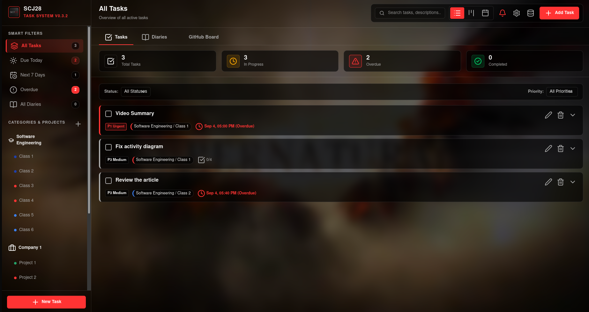

# SCJ28 - Academic & Startup Task Manager

[](LICENSE)
[](package.json)

SCJ28 is a lightweight, modern, minimalist task management web application designed for organizing academic course workloads, personal goals, and startup/work projects.



## ✨ Key Features

- **Hierarchical Organization**: Categorize tasks into Academic, Personal, and Work/Startup categories and projects.
- **Multiple Views**: Interactive List, Kanban Board, and Calendar layout modes.
- **4-Tier Priority System**: Urgent (P1), High (P2), Medium (P3), and Low (P4).
- **Subtasks & Checklists**: Interactive subtask lists with checkmark toggling.
- **GitHub Integration**: Connect projects with GitHub repos/projects, view issues, import tasks, and sync status.
- **Minimalist Dark Mode UI**: Glassmorphic translucent panels with customizable opacity (60% to 100%) and custom background image support.
- **PWA & Offline First**: Service Worker caching, offline shell, standalone app installation, and network status alerts.
- **Desktop Notifications**: HTML5 Web Desktop Notifications for due and overdue tasks.

## 🚀 Quick Start

### Prerequisites
- Node.js (v18+)
- npm

### Execution
```bash
# Option A (Linux/macOS): Run bash launcher script
./run.sh

# Option B (Windows): Run batch launcher script
run.bat

# Option C: Direct Node execution
node server.js
```
Access the application in your browser at `http://localhost:2800`.

## 📚 Documentation

Detailed technical documentation is available in the [`docs/`](./docs/README.md) directory:
- [Software Requirements Specification (SRS)](./docs/REQUIREMENTS.md)
- [Use Cases & User Flows](./docs/USE_CASES.md)
- [Class Diagram & System Models](./docs/CLASS_DIAGRAM.md)
- [REST API Specification](./docs/API_SPECIFICATION.md)

## 📄 License

Distributed under the MIT License. See [`LICENSE`](./LICENSE) for details.
Copyright (c) 2026 Sidnei Correia Junior.
