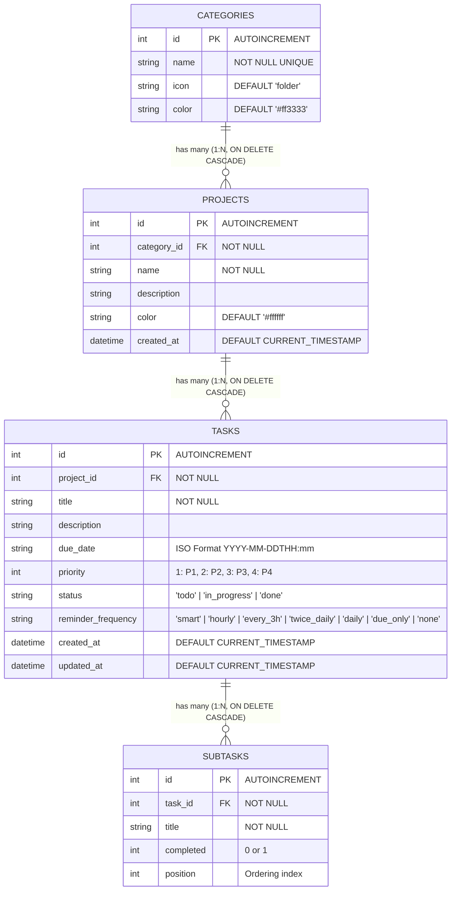
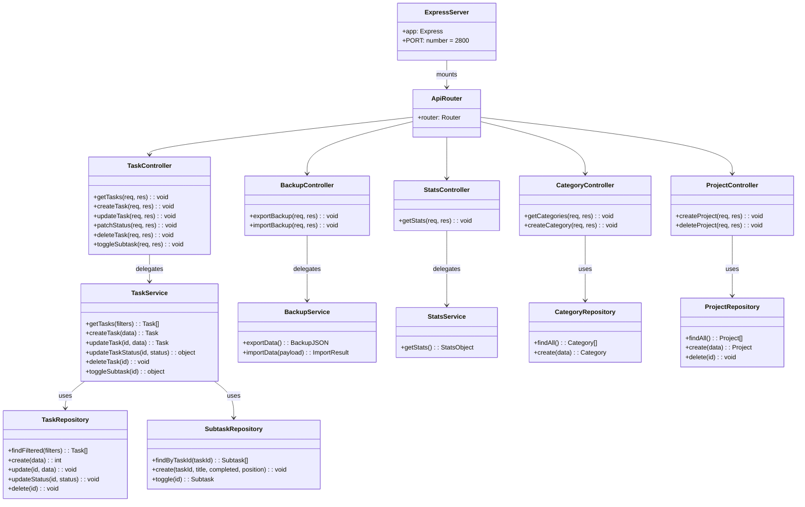

# Class Diagram & System Architecture Models - SCJ28

This document presents structural diagrams, database entity-relationship models, UML class representations, and client state contracts for SCJ28.

---

## 1. Database Entity-Relationship Diagram (ERD)

The diagram below illustrates the SQLite database schema relationships managed by `database.js` and `better-sqlite3`.



---

## 2. Server & Client Layered Architecture UML Class Diagram

The class diagram below displays the S.O.L.I.D decoupled layered architecture (Controller -> Service -> Repository -> Database) and client ES6 module components.



---

## 3. Client State Management Object Schema

In `public/js/state/store.js`, the central application state is held within a single reactive `Store` instance:

```typescript
interface ClientState {
  categories: CategoryWithProjects[];
  tasks: TaskWithSubtasks[];
  stats: {
    total: number;
    completed: number;
    pending: number;
    overdue: number;
    dueToday: number;
  };
  activeFilter: 'all' | 'today' | 'upcoming' | 'overdue';
  activeCategory: number | null;
  activeProject: number | null;
  currentView: 'list' | 'kanban' | 'calendar';
  searchQuery: string;
  filterStatus: string;
  filterPriority: string;
  calendarDate: Date;
  editingTaskId: number | null;
}
```

---

## 4. Import / Export Data Contract

The JSON schema contract produced by `GET /api/export` and accepted by `POST /api/import` is defined as:

```json
{
  "$schema": "http://json-schema.org/draft-07/schema#",
  "type": "object",
  "properties": {
    "version": { "type": "integer", "default": 1 },
    "exported_at": { "type": "string", "format": "date-time" },
    "categories": {
      "type": "array",
      "items": {
        "type": "object",
        "properties": {
          "id": { "type": "integer" },
          "name": { "type": "string" },
          "icon": { "type": "string" },
          "color": { "type": "string" }
        },
        "required": ["name"]
      }
    },
    "projects": {
      "type": "array",
      "items": {
        "type": "object",
        "properties": {
          "id": { "type": "integer" },
          "category_id": { "type": "integer" },
          "name": { "type": "string" },
          "description": { "type": "string" },
          "color": { "type": "string" }
        },
        "required": ["category_id", "name"]
      }
    },
    "tasks": {
      "type": "array",
      "items": {
        "type": "object",
        "properties": {
          "id": { "type": "integer" },
          "project_id": { "type": "integer" },
          "title": { "type": "string" },
          "description": { "type": "string" },
          "due_date": { "type": ["string", "null"] },
          "priority": { "type": "integer" },
          "status": { "type": "string" }
        },
        "required": ["project_id", "title"]
      }
    },
    "subtasks": {
      "type": "array",
      "items": {
        "type": "object",
        "properties": {
          "id": { "type": "integer" },
          "task_id": { "type": "integer" },
          "title": { "type": "string" },
          "completed": { "type": "integer" },
          "position": { "type": "integer" }
        },
        "required": ["task_id", "title"]
      }
    }
  }
}
```
